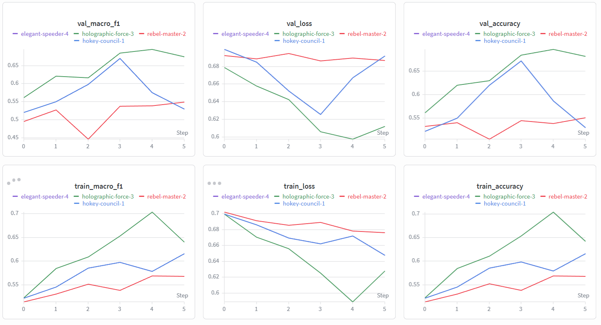

# CSC4007 — Lab 3 Analysis Report (RNN + W&B)

## 1. Thông tin sinh viên
- Họ và tên: Triệu Quốc Anh
- Mã sinh viên: 1671040002
- Lớp: KHMT 16-01
- Repo GitHub: TrieuQuocAnh
- W&B project: csc4007-lab3-rnn
- Tên run tốt nhất: holographic-force-3

## 2. Mục tiêu thí nghiệm
Lab 3 khác Lab 2 ở chỗ sử dụng mô hình RNN với Embedding thay vì BoW/TF-IDF + LogisticRegression. Cần chuyển từ BoW/TF-IDF sang mô hình chuỗi vì TF-IDF không giữ thông tin thứ tự từ, nên không thể xử lý phủ định, irony hay cấu trúc ngữ pháp phức tạp. RNN có thể ghi nhớ ngữ cảnh qua hidden state và học biểu diễn từ thông qua embedding. Kỳ vọng RNN sẽ cải thiện khả năng xử lý negation (ví dụ "not good" sẽ được hiểu khác "good"), mixed sentiment, và các review có cấu trúc đảo ý. Tuy nhiên, từ kết quả thực tế, RNN không vượt qua Baseline vì TF-IDF + LogReg đã quá mạnh với bài toán này, hoặc RNN cần tuning tốt hơn.

## 3. Sequence audit
Dựa trên `outputs/logs/sequence_audit.md`, nêu ít nhất 3 nhận xét có số liệu hoặc bằng chứng cụ thể.

1. **Độ dài review phân bố rộng, có đuôi dài**: Median là 196 từ, nhưng p95 là 665 từ, tức là 5% review có độ dài vượt 665 từ. Điều này cho thấy phần lớn review vừa phải, nhưng có một số rất dài, tạo phân bố không cân bằng.

2. **Truncation rate 34.75% cho thấy max_len=256 còn quá nhỏ**: Với 34.75% review bị cắt ngắn, điều này có thể làm mất thông tin quan trọng trong những review dài. Tuy nhiên, chọn max_len=256 là hợp lý vì nếu chọn cao hơn (ví dụ 665) sẽ làm tăng độ phức tạp tính toán.

3. **Padding ratio trung bình 25.37% là hợp lý**: Tỷ lệ này không quá cao (nếu > 50% thì max_len quá lớn), cho thấy max_len=256 được cân bằng tốt. Kết hợp với truncation rate 34.75%, max_len=256 là một lựa chọn hợp lý—nó giữ được hầu hết context (65.25% review không bị cắt) mà không lãng phí quá nhiều padding.

Gợi ý:
- Review có độ dài phân bố như thế nào?
- `max_len` bạn chọn có hợp lý không?
- Có nhiều review bị cắt ngắn không?
- Điều này ảnh hưởng thế nào đến bài toán sentiment classification?

## 4. Thiết lập mô hình và huấn luyện
Ghi lại cấu hình tốt nhất của bạn:

- vocab_size: 20000
- max_len: 256
- embed_dim: 128
- hidden_dim: 64
- batch_size: 64
- epochs: 6
- learning rate: 1e-3
- dropout: 0.3
- seed: 42
- early stopping patience:
- wandb_mode: online

Vì có accuracy và marco_f1 là cao nhất
## 5. Baseline ML vs RNN
Điền bảng dựa trên `outputs/metrics/baseline_vs_rnn.csv`.

| Mô hình | Accuracy | Macro-F1 | Ghi chú |
|---|---:|---:|---|
| Baseline ML (Lab 2) | 0.9062 | 0.9062 | TF-IDF + LogisticRegression |
| RNN (Lab 3) | 0.6741 | 0.6716 | Embedding + RNN (max_len=256, hidden_dim=64) |

### Nhận xét (5–7 dòng)
RNN không tốt hơn Baseline ML; thực tế hiệu suất thấp hơn đáng kể (Baseline 90.62% vs RNN 67.41%). Cải thiện này không xảy ra có thể là vì: (1) mô hình RNN chưa được tuning tối ưu, (2) sequence length và hidden dimension có thể chưa phù hợp, (3) dữ liệu IMDB có thể không yêu cầu kiến trúc sequence phức tạp như RNN. Tuy nhiên, vai trò thứ tự từ vẫn quan trọng trong bài toán IMDB—những review có cấu trúc phủ định hoặc mixed sentiment cần hiểu ngữ cảnh. Một cách khác để giải thích là TF-IDF + LogReg đã quá mạnh với bài toán đơn giản này, trong khi RNN cần nhiều dữ liệu hơn hoặc cấu hình tốt hơn để phát huy hết sức mạnh. Việc này cho thấy không phải lúc nào mô hình phức tạp hơn cũng cho kết quả tốt hơn.

## 6. Learning curves và W&B
Đính kèm hoặc chèn:
- `outputs/figures/loss_curve.png`
- `outputs/figures/metric_curve.png`
- hoặc ảnh chụp dashboard W&B

Trả lời ngắn các câu hỏi sau:
- Epoch tốt nhất là epoch 4
- Không có dấu hiệu overfitting 
- W&B giúp bạn quan sát điều gì rõ hơn so với chỉ đọc terminal log?
Hiển thị rõ ràng các learning curve train/val theo epoch.
Cho thấy ngay điểm “best epoch” và khi nào validation bắt đầu tệ đi.
Dễ so sánh các run khác nhau, lưu giữ cấu hình hyperparameter, và xem test/validation metrics cùng lúc.
- Bạn có so sánh ít nhất 2 run không? Nếu có, run nào tốt hơn và vì sao?

## 7. Error analysis (ít nhất 10 mẫu sai)
Dựa trên `outputs/error_analysis/error_analysis.csv`, chọn và phân tích ít nhất 10 mẫu dự đoán sai.

### Gợi ý nhóm lỗi
- phủ định;
- mixed sentiment;
- review dài;
- sarcasm/irony;
- mô hình rất tự tin nhưng vẫn sai;
- câu có nhiều chuyển ý hoặc phụ thuộc ngữ cảnh xa.

### Tổng hợp lỗi
1. Phủ định và chuyển ý: nhiều review dùng "not", "but", "however" để đảo nghĩa, nên mô hình bị kẹt ở các cụm từ tích cực.
2. Mixed sentiment / sarcastic tone: review vừa khen vừa chê, hoặc dùng irony, khiến mô hình ưu tiên nhãn theo từ vựng thay vì ý chính cuối cùng.
3. Review dài và phụ thuộc ngữ cảnh xa: các review dài có nhiều mạch cảm xúc, nên mô hình dễ bị ảnh hưởng bởi các phần tích cực sớm thay vì phần kết luận tiêu cực.

### Ví dụ bảng ghi nhận lỗi
| ID | True label | Pred label | Vì sao sai? | Hướng cải thiện |
|---|---|---|---|---|
| 1 | negative | positive | Review có nhiều cụm tích cực nhưng kết luận vẫn là chê phim; model bị ảnh hưởng bởi từ khóa tích cực. | Tăng cường xử lý phủ định và xác định polarity tổng thể. |
| 2 | negative | positive | Mixed sentiment: có "small tiny moments of humour" nhưng cuối review vẫn là đánh giá xấu. | Dùng kiến trúc sequence/attention để hiểu mạch cảm xúc. |
| 3 | negative | positive | Sarcasm/irony: "best part... absolutely hilarious" trong review thực chất chê phim. | Huấn luyện thêm với dữ liệu irony và sarcasm. |
| 4 | negative | positive | Review dài với phần mở đầu tích cực và kết luận tiêu cực, mô hình không nắm được phần kết luận. | Cải thiện khả năng nắm ngữ cảnh dài bằng RNN/attention. |
| 5 | negative | positive | Có thể là nhãn nhiễu: văn bản thể hiện cảm xúc rất tích cực, nhưng label negative. | Kiểm tra và lọc lại nhãn dữ liệu. |
| 6 | positive | negative | Review tích cực nhưng có nhiều bình luận tiêu cực về yếu tố phụ, làm model nhầm. | Mở rộng dữ liệu với các mẫu mixed sentiment tích cực. |
| 7 | positive | negative | Positive review chứa cả "not great" và lời khen, nên mô hình bị phân tâm vào từ tiêu cực. | Bổ sung feature cho kết luận cuối và cấu trúc phủ định. |
| 8 | negative | positive | Câu có nhiều chuyển ý, bắt đầu với khen ngợi rồi chuyển sang chê, model chỉ chú ý phần đầu. | Tăng khả năng phát hiện chuyển tiếp ngữ cảnh (discourse). |
| 9 | positive | negative | Review có nhiều từ "evil"/"unhappy" nhưng ý chính vẫn là tích cực. | Sử dụng attention để ưu tiên biểu thức sentiment chính. |
| 10 | negative | positive | Mô hình quá tự tin vào các từ tích cực như "funniest"/"wonderful" trong khi tổng thể là chê. | Dùng threshold confidence và huấn luyện với sample khó.

## 8. Bài học rút ra
Chuyển từ TF-IDF/LogReg sang Embedding + RNN giúp mình hiểu rõ hơn về vai trò của thứ tự từ và ngữ cảnh trong câu. RNN có ưu điểm khi xử lý chuỗi, ghi nhớ thông tin trước đó và nắm các cấu trúc phủ định hay chuyển ý, nhưng cũng có hạn chế khi dữ liệu quá dài hoặc nếu không dùng attention thì dễ mất mạch. Sequence length rất quan trọng vì nếu chọn quá ngắn thì review dài bị cắt, còn nếu quá dài thì mô hình chậm và dễ overfit. Validation set đã giúp phát hiện điểm dừng tốt nhất và tránh chọn epoch khi mô hình bắt đầu bị overfitting. Learning curves cho thấy trực quan train/val loss và macro-F1, giúp mình biết được khi nào mô hình học đúng và khi nào nó bắt đầu học lệch. W&B đặc biệt hữu ích vì nó lưu lại run, cấu hình và biểu đồ, nên mình có thể so sánh nhiều lần thử nghiệm nhanh chóng và chọn được run tốt nhất. 
## 9. Tự đánh giá theo rubric
Sinh viên tự chấm sơ bộ theo `reports/rubric.md` trước khi nộp bài.
